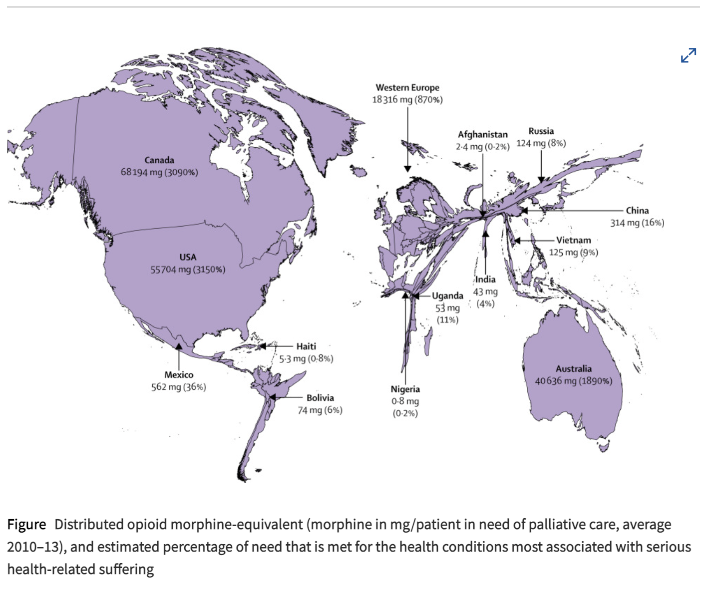

# Diminishing Returns

> **The behavioral adaptations to prolonged use of opioid drugs such as heroin and morphine include tolerance, defined as a reduced sensitivity to the drug effects and generally referring to attenuation of analgesic efficacy, and dependence revealed by drug craving and the physiological manifestations of drug withdrawal. ... Adaptive responses to repeated opioid administration are important considerations in the clinical arena and lead physicians to hesitate prescribing opioid drugs for the treatment of pain. The “holy grail” of opioid research has long been to develop drugs, or drug administration strategies, that result in effective analgesia without the detrimental adaptive responses.**

Source: [Opioid Tolerance–In Search of the Holy Grail](https://www.sciencedirect.com/science/article/pii/S0092867402006669) (2002)

## Summary

Cancer patients on long-term opioids often find that pain relief fades as tolerance sets in. This document investigates what's actually known about why, surveys the candidate interventions, and asks where funding could have the most leverage.

## Access gap

Before tolerance is even the binding constraint, many patients receive little or no opioid analgesia. The Lancet Commission figure below shows the global skew in distributed opioid morphine-equivalent per patient in need of palliative care, averaged over 2010-13, alongside the estimated share of serious health-related suffering need that is met. ([Lancet Commission][14])

## Tolerance vs dependence vs OIH

**Tolerance** is a rightward shift in the dose–response curve: the same dose yields progressively less analgesia, and the original effect can be restored, for a while, by escalating the dose. This is what the figure in this document captures, and what the "holy grail" framing actually targets. Tolerance also develops unevenly across an opioid's effects, so analgesic tolerance dissociates from tolerance to respiratory depression and constipation. The target here is specifically analgesic tolerance.

**Dependence** sits on a different axis entirely. It is not about ongoing efficacy; it is a state of physiological adaptation in which abrupt cessation or an antagonist precipitates withdrawal. Two things matter. First, dependence is near-universal in chronically treated patients, an expected pharmacological consequence rather than a complication. Second, and the more costly error: dependence is not addiction. Addiction (opioid use disorder) is a behavioral disorder of compulsive use; physical dependence is not. Conflating the two is part of what drives clinicians to under-treat cancer pain, which ties this section directly to the access argument later.

**Opioid-induced hyperalgesia (OIH)** is the paradoxical case: the opioid itself sensitizes the patient to pain, often diffusely and beyond the original site. Clinically it can look identical to tolerance, with pain rising on a stable dose, but the correct response is the opposite. Tolerance you can often out-dose; with OIH, more opioid makes it worse, and the fix is dose reduction, rotation, or an adjunct. This single divergence is the most important practical reason the distinction matters: mistake one for the other and the reflexive move, escalation, is the wrong one.

## Mechanism landscape

| Candidate | What it is | Human evidence | Status |
| --- | --- | --- | --- |
| [**Opioid rotation**](mechanism.html?candidate=opioid-rotation) | Switch from one opioid to another, or change route, when analgesia is inadequate or side effects are intolerable. The logic is incomplete cross-tolerance: tolerance to one opioid does not fully transfer to the next. | Common, practical cancer-pain maneuver. Rotation is needed in roughly 20-44% of cancer-pain patients and produces clinical improvement in about 40-80% of cases. New opioid doses are usually reduced 30-50% from calculated equianalgesic estimates, then titrated. | Active work |
| [**Methadone-centered opioid rotation**](mechanism.html?candidate=methadone-centered-opioid-rotation) | Use methadone when standard opioids stop working or cause OIH/tolerance; methadone has opioid activity plus NMDA-antagonist properties. | Best near-term clinical story, and now independently replicated. A 2021 cancer-induced bone pain cohort (Cabrini/Monash) found 94 patients completed methadone rotation; 70.2% had ≥30% pain reduction, pain fell from 5.6 to 2.6, and breakthrough opioid use fell. The same group's 2024 pilot RCT found rotation feasible, safe, and acceptable, but was not powered for efficacy. A separate 2026 retrospective at Trinity Health Grand Rapids (n=27), with no link to the Melbourne group, found the same direction: pain 7→4 and breakthrough opioid 90→31 MME. ([Monash University][1]; [PubMed][12]; [JPPCP][15]) | Active work |
| [**Buprenorphine rotation**](mechanism.html?candidate=buprenorphine-rotation) | Switch long-term full agonist opioid patients to buprenorphine, a partial μ-agonist with possible antihyperalgesic properties. | A 2021 systematic review of 22 studies found low-quality evidence that buprenorphine rotation reduced pain without precipitating withdrawal or serious adverse events. ([JAMA Network][2]) | Pending |
| [**Ultra-low-dose naltrexone/naloxone with opioids**](mechanism.html?candidate=ultra-low-dose-naltrexone-naloxone-with-opioids) | Tiny antagonist doses added to opioids; the "cheap miracle" candidate. | Very strong rodent story: reduced tolerance/dependence and enhanced analgesia. Human data are mixed. Oxytrex trials showed dose-sensitive analgesic and physical-dependence signals, but effects depend on a very narrow dose window; higher "ultra-low" doses can lose the benefit. ([Sage Journals][3]) | Pending |
| [**Ketamine**](mechanism.html?candidate=ketamine) | NMDA antagonist; can counter central sensitization/OIH and reduce opioid requirements. | Evidence is strongest in perioperative or selected refractory contexts. Reviews say ketamine may modulate OIH/tolerance, but evidence is insufficient for broad refractory cancer-pain use as an opioid adjunct. ([Pain Physician][4]) | Pending |
| [**Amantadine, magnesium, dexmedetomidine, pregabalin, NSAID adjuncts**](mechanism.html?candidate=amantadine-magnesium-dexmedetomidine-pregabalin-nsaid-adjuncts) | Perioperative anti-OIH/opioid-sparing drugs, many already cheap/generic. | A 2023 network meta-analysis of 33 RCTs / 1,711 patients found several interventions associated with lower postoperative pain after opioid-based anesthesia; amantadine ranked best for pain, while dexmedetomidine was the only intervention that outperformed placebo across all indicators. ([Frontiers][6]) | Pending |
| [**Ibudilast**](mechanism.html?candidate=ibudilast) | Glial/PDE/TLR4-ish modulator; used in Japan/Korea for other indications. | Human lab data are intriguing but small. A study in 11 opioid-dependent male volunteers found ibudilast may enhance oxycodone analgesia and may be useful for OUD-related outcomes; broader validation is lacking. ([Nature][7]) | Pending |
| [**G-protein-biased / release-preferring μ-opioid agonists, e.g. SR-17018-style work**](mechanism.html?candidate=g-protein-biased-release-preferring-mu-opioid-agonists) | New opioid ligands designed to preserve analgesia with less tolerance/respiratory depression. | Very interesting preclinical frontier. A 2025 Nature paper found release-preferring agonists prolonged morphine/fentanyl antinociception in mice without enhancing fentanyl respiratory/cardiac effects, but the authors emphasize these are simple mouse thermal-nociception measures. ([Nature][10]) | Pending |
| [**Dextromethorphan / MorphiDex**](mechanism.html?candidate=dextromethorphan-morphidex) | Cheap oral NMDA antagonist combined with morphine. | This was the obvious cheap bet, and it largely failed. Three multicenter randomized double-blind trials of MorphiDex failed to show enhanced opioid analgesia or reduced tolerance; another phase III cancer/severe pain study also failed to show meaningful benefit. ([PubMed][5]) | Pending |
| [**Oliceridine / biased agonism already translated**](mechanism.html?candidate=oliceridine-biased-agonism-already-translated) | FDA-approved biased μ-opioid agonist for acute pain. | It reached the clinic, but it still carries opioid-class respiratory/addiction warnings; Trevena reduced commercial support in 2024 and discontinued remaining OLINVYK sales as of Dec. 31, 2024 for business/financial reasons. ([ASCPT][11]; [Trevena][13]) | Pending |
| [**Minocycline / glial inhibitors**](mechanism.html?candidate=minocycline-glial-inhibitors) | Antibiotic/microglial inhibition hypothesis. | Preclinical evidence looked good, but a human study found minocycline did not change pain threshold/tolerance, pain severity, opioid craving, or withdrawal in opioid-maintained people. ([PMC][8]) | Pending |
| [**Ondansetron / 5-HT3 antagonists**](mechanism.html?candidate=ondansetron-5-ht3-antagonists) | Anti-nausea drug; animal data suggested effects on tolerance/OIH. | Human signal weak. In a cesarean-spinal opioid study, ondansetron did not significantly affect postoperative pain or opioid consumption; another human withdrawal study found no reduction in withdrawal severity. ([HERO][9]) | Pending |

## Funding ask stub

The open fundable question is whether a small, pragmatic methadone-centered rotation trial could produce a decision-relevant answer for cancer pain patients whose opioid analgesia is failing. That trial does not exist: the 2024 pilot's own authors called for an "appropriately powered multi-centre" successor, and as of June 2026 none is registered on the ANZCTR or ClinicalTrials.gov. ([ANZCTR][16]) The original investigator, Natasha Michael, has since moved from Director of Palliative Care at Cabrini Health to Associate Professor at the University of Notre Dame Australia, so whether the trial stays with her former Cabrini/Monash colleagues or needs a new home is itself part of the gap. ([Notre Dame][17]) Access expansion may still be the higher-value intervention for patients who receive no adequate opioid analgesia at all; this case is about a complementary downstream bottleneck, not a substitute for getting existing morphine to untreated patients.

**Needed next:** estimate the cost of that trial from real comparators: palliative-care pilot RCTs, methadone rotation studies, oncology supportive-care trials, site/count assumptions, recruitment burden, and follow-up length. Until that number is pinned down, this document can identify the best candidate, but it cannot yet make a credible funding ask.

[1]: https://research.monash.edu/en/publications/the-role-of-methadone-in-cancer-induced-bone-pain-a-retrospective/ "The role of methadone in cancer-induced bone pain"
[2]: https://jamanetwork.com/journals/jamanetworkopen/fullarticle/2784021 "Evaluation of Buprenorphine Rotation in Patients"
[3]: https://journals.sagepub.com/doi/10.4137/CMT.S4870 "Ultra-Low-Dose Naloxone or Naltrexone to Improve Opioid Analgesia"
[4]: https://www.painphysicianjournal.com/current/pdf?article=MTQ0Ng%3D%3D&journal=60 "A Comprehensive Review of Opioid-Induced Hyperalgesia"
[5]: https://pubmed.ncbi.nlm.nih.gov/15911155/ "MorphiDex (Morphine sulfate/dextromethorphan)"
[6]: https://www.frontiersin.org/journals/pharmacology/articles/10.3389/fphar.2023.1199794/full "Pharmacological interventions for preventing opioid-induced hyperalgesia"
[7]: https://www.nature.com/articles/npp201770 "Effects of Ibudilast on the Subjective, Reinforcing, and Analgesic Effects"
[8]: https://pmc.ncbi.nlm.nih.gov/articles/PMC6581631/ "Minocycline does not affect experimental pain"
[9]: https://hero.epa.gov/reference/10420915/ "The Effect of Ondansetron on Acute Opioid Tolerance"
[10]: https://www.nature.com/articles/s41586-025-09880-5 "GTP release-selective agonists prolong opioid analgesic action"
[11]: https://www.ascpt.org/Resources/ASCPT-News/View/articleid/25154 "FDA News: Issue 25, August 2020"
[12]: https://pubmed.ncbi.nlm.nih.gov/38980427/ "Methadone versus other opioids for refractory malignant bone pain"
[13]: https://www.trevena.com/investors/financial-information/all-sec-filings/content/0001104659-25-003715/tm253448d1_8k.htm "Trevena Current Report on Form 8-K"
[14]: https://www.thelancet.com/journals/langlo/article/PIIS2214-109X(18)30082-2/fulltext "The Lancet Commission on Palliative Care and Pain Relief—findings, recommendations, and future directions"
[15]: https://pubmed.ncbi.nlm.nih.gov/41511057/ "Evaluating Methadone as Treatment for Refractory Cancer-Induced Bone Pain"
[16]: https://www.anzctr.org.au/Trial/Registration/TrialReview.aspx?id=380812 "ANZCTR: Methadone rotation versus other opioid rotation for refractory cancer induced bone pain"
[17]: https://www.notredame.edu.au/research/institutes-and-initiatives/institute-for-health-research/people/natasha-michael "Natasha Michael, Institute for Health Research, University of Notre Dame Australia"
